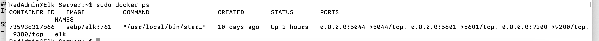

## Automated ELK Stack Deployment

The files in this repository were used to configure the network depicted below.

 VN_HW 12 Cloud Diagram.png

These files have been tested and used to generate a live ELK deployment on Azure. They can be used to either recreate the entire deployment pictured above. Alternatively, select portions of the Ansible playbook file may be used to install only certain pieces of it, such as Filebeat.

  - Enter the playbook file._.  root@adb3099859f5:/etc/ansible# ansible-playbook

This document contains the following details:
- Description of the Topology
- Access Policies
- ELK Configuration
  - Beats in Use
  - Machines Being Monitored
- How to Use the Ansible Build

### Description of the Topology

The main purpose of this network is to expose a load-balanced and monitored instance of DVWA, the D*mn Vulnerable Web Application.

Load balancing ensures that the application will be highly available, in addition to restricting access to the network.
- What aspect of security do load balancers protect? What is the advantage of a jump box?

Load balancers protect the system from having an overload attack such as a DDOS (Denial of Service). A jump box allows admins to access internal environments without exposing them to threats on the outside. 

Integrating an ELK server allows users to easily monitor the vulnerable VMs for changes to the data and system logs.
- What does Filebeat watch for?  It monitors the log files and locations and forwards them to Elasticsearch or Logstash for indexing. 
- What does Metricbeat record? It takes the metrics and statistics that are collected and sends it to the output you choose such as Elasticsearch or Logstash.

The configuration details of each machine may be found below.
_Note: Use the [Markdown Table Generator](http://www.tablesgenerator.com/markdown_tables) to add/remove values from the table_.

| Name                 | Function        | IP Address | Operation System |
|----------------------|-----------------|------------|------------------|
| Jump-Box-Provisioner | Virtual Machine | 10.0.0.4   | Linux            |
| Elk-Server           | Virtual Machine | 10.1.0.4   | Linux            |
| Web-1                | Virtual Machine | 10.0.0.5   | Linux            |
| Web-2                | Virtual Machine | 10.0.0.6   | Linux            |

### Access Policies

The machines on the internal network are not exposed to the public Internet. 

Only the jump box machine can accept connections from the Internet. Access to this machine is only allowed from the following IP addresses:
- Add whitelisted IP addresses_

My personal computer IP address

Machines within the network can only be accessed by the jump box.
- Which machine did you allow to access your ELK VM? What was its IP address?_

I allowed the Jump-Box-Provisioner machine to access my ELK VM. The IP address is 10.0.0.4

A summary of the access policies in place can be found in the table below.

| Name                 | Publicly Accessible | Allowed IP Addresses |
|----------------------|---------------------|----------------------|
| Jump-Box-Provisioner | Yes                 | my personal IP        |
| Elk-Server           | Yes                 | Any                  |
| Web-1                | Yes                 | Any                  |
| Web-2                | Yes                 | Any                  |

### Elk Configuration

Ansible was used to automate configuration of the ELK machine. No configuration was performed manually, which is advantageous because...
- What is the main advantage of automating configuration with Ansible?_

Ansible allows you to automate applications to save time and prevent human error.

The playbook implements the following tasks:
- In 3-5 bullets, explain the steps of the ELK installation play. E.g., install Docker; download image; etc._
- 1. Install docker.io - docker is used to create containers which are lightweight virtual machines that can be run in any environment
- 2. Install python3-pip which is used to manage software packages
- 3. Install Docker module to deliver the software quickly
- 4. Increase virtual memory
- 5. Download and launch a docker elk container to get started

The following screenshot displays the result of running `docker ps` after successfully configuring the ELK instance.

sebp/elk/761/docker_ps_output.png

### Target Machines & Beats
This ELK server is configured to monitor the following machines:
- List the IP addresses of the machines you are monitoring_

The ELK server is configured to monitor the following machines:
Web-1 10.0.0.5
Web-2 10.0.0.6

We have installed the following Beats on these machines:
- Specify which Beats you successfully installed_
Web-1 10.0.0.5 - filebeat and metricbeat
Web-2 10.0.0.6 - filebeat and metricbeat

These Beats allow us to collect the following information from each machine:
- In 1-2 sentences, explain what kind of data each beat collects, and provide 1 example of what you expect to see. E.g., `Winlogbeat` collects Windows logs, which we use to track user logon events, etc._

Filebeat collects data about the file system, such as location.
Metricbeat collects machine metrics, such as uptime.

### Using the Playbook
In order to use the playbook, you will need to have an Ansible control node already configured. Assuming you have such a control node provisioned: 

SSH into the control node and follow the steps below:
- Copy the Ansible playbook file to the container.
- Update the Ansible playbook file to include filebeat-playbook.yml 
- Run the playbook, and navigate to /etc/ansible# ansible-playbook filebeat-playbook.yml 
to check that the installation worked as expected.

-Answer the following questions to fill in the blanks:_
- _Which file is the playbook? filebeat-config.yml. Where do you copy it? /etc/ansible#
- _Which file do you update to make Ansible run the playbook on a specific machine? Nano filebeat-config.yml. How do I specify which machine to install the ELK server on versus which to install Filebeat on? The first lines of the playbook tell which host machine to install on and they are:
---
- name: Config Web VM with Docker
  hosts: web
  become: true

- _Which URL do you navigate to in order to check that the ELK server is running? ElkserverPublicIP:5601/app/kibana which translates to 20.230.215.176:5601/app/kibana
For my elk server 

_As a **Bonus**, provide the specific commands the user will need to run to download the playbook, update the files, etc._